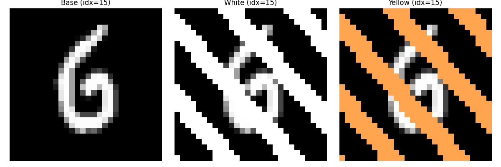

# MNIST Stripes Dataset

This repository contains a small collection of MNIST-like datasets designed for toy experiments and quick prototyping.  
The data includes:

- **mnist_white_stripes** — MNIST digits with added white vertical stripes  
- **mnist_yellow_stripes** — MNIST digits with added yellow vertical stripes  
- **mnist** — the original MNIST digits

These datasets were created and used in the accompanying paper:

> **Semi-Supervised Fine-Tuning of Vision Foundation Models with Content-Style Decomposition**  
> Authors: Mariia Drozdova, Vitaliy Kinakh, Yury Belousov, Erica Lastufka, Slava Voloshynovskiy 
> Preprint / DOI: https://arxiv.org/abs/2410.02069

The data is stored in the standard **Hugging Face `datasets`** format (`DatasetDict` with image columns), enabling straightforward loading in Python:

```python
from datasets import load_from_disk
ds = load_from_disk("mnist_white_stripes")
```

An example notebook, **`example-usage.ipynb`**, demonstrates simple loading and visualization.

---

## Example



---

## Purpose

This dataset is lightweight (~150 MB total) and is meant for:

- quick experiments  
- debugging architectures  
- testing robustness to structured noise  
- teaching / reproducibility demos  

Feel free to use or modify it for research or educational purposes.


## Citation

If you use this dataset, please cite:

```
@misc{drozdova2024semisupervisedfinetuningvisionfoundation,
      title={Semi-Supervised Fine-Tuning of Vision Foundation Models with Content-Style Decomposition}, 
      author={Mariia Drozdova and Vitaliy Kinakh and Yury Belousov and Erica Lastufka and Slava Voloshynovskiy},
      year={2024},
      eprint={2410.02069},
      archivePrefix={arXiv},
      primaryClass={cs.CV},
      url={https://arxiv.org/abs/2410.02069}, 
}
```

and the original MNIST dataset:

```
@article{mnist,
  author={LeCun, Yann and Cortes, Corinna},
  title={The MNIST database of handwritten digits},
  journal={http://yann.lecun.com/exdb/mnist/}
}
```
